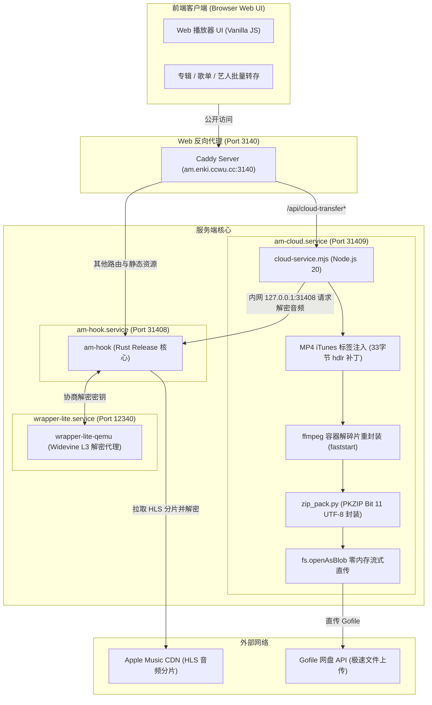

# am-hook 自动化运维与智能体（AI Agent）维护指南

> **文档定位**：本手册专为后续接手本项目维护、故障排查与迭代更新的 **AI Coding Agent** 及开发维护人员编写。
> 阅读本文档可快速理解整个系统的服务拓扑、核心数据流向、关键代码实现、已知踩坑点与标准运维排障步骤。

---

## 1. 架构拓扑与服务中枢

本项目运行于 Oracle Cloud ARM64 实例（Ubuntu 24.04），系统由四个微服务配合运行：



### 端口与服务对照表

| 服务标识 | 进程/脚本 | 监听地址 | 核心职责 |
| :--- | :--- | :--- | :--- |
| **`caddy`** | Caddy Server | `am.enki.ccwu.cc:3140` | 对外统一入口。`/api/cloud-transfer*` 路由至 `31409`，其余至 `31408`。 |
| **`am-cloud`** | [`cloud-service.mjs`](file:///D:/ai/am-hook/cloud-service.mjs) | `127.0.0.1:31409` | 云端转存中枢：元数据抓取、MP4 标签注入、**Progressive 解碎片重封装**、全辑 ZIP 打包、Gofile 直传。 |
| **`am-hook`** | `target/release/am-hook` | `0.0.0.0:31408` | Rust 解密内核：解析 Apple Music Master M3U8、解密 HLS 分片、提供单页 Web 应用。 |
| **`wrapper-lite`** | `wrapper-lite-qemu` | `127.0.0.1:12340` | Widevine L3 解密模块，负责 SKD 证书与私钥解密。 |
| **`keepidle`** | `stress-ng` | N/A | **甲骨文免费云保活专用进程**，固定维持 22% CPU 与 2.5GB 内存。**切勿关闭！** |

---

## 2. 核心技术实现与排坑手册

### 2.1 移动端（椒盐音乐 / Android 原生播放器）“编码错误”解密与修复

- **根本原因**：
  Apple Music CDN 下发的是 **HLS Fragmented MP4 (fMP4)**，由一系列 `moof` + `mdat` 分片盒组成，其 `moov` 头部内采样表为空（`sample_count = 0`）。
  电脑端（Foobar2000、PotPlayer）与手机端 MT 管理器内置播放器基于 FFmpeg 软解，能直接识别 fMP4。
  但安卓主流播放器（如**椒盐音乐 Salt Player**）采用 Google ExoPlayer / 原生 `MediaCodec` 解码器，强制要求标准 **Progressive MP4**（`moov` 在头部，包含完整的 `stts`/`stsc`/`stsz`/`stco` 采样表索引）。读取本地 fMP4 文件时找不到样本，直接报 **“编码错误”**。
- **解决方案**：
  在 [`cloud-service.mjs`](file:///D:/ai/am-hook/cloud-service.mjs) 的 `defragMp4Buffer()` 中，调用系统级 `ffmpeg` 进行纯容器重封装：
  ```bash
  ffmpeg -y -v error -i tmpIn.m4a -c copy -movflags +faststart tmpOut.m4a
  ```
  - **-c copy**：零编解码计算，100% 逐比特无损保留原始 ALAC/AAC 音频流，内嵌歌词与封面毫发无损；
  - **-movflags +faststart**：将 `moov` 重建并移至文件首部，消除所有 `moof` 分片盒；
  - **执行效率**：单曲耗时仅约 0.05s ~ 0.1s。

### 2.2 大专辑/全作品上传时防 OOM 内存泄漏机制

- **历史踩坑**：
  曾出现 `am-cloud` 内存峰值飙至 **3.9 GB**。原因是用 `fs.readFileSync(zipFilePath)` 读入大 ZIP，再用 `new Blob([zipBuf])` 复制，瞬间塞满 V8 堆内存导致 OOM。
- **核心规避方案**：
  必须使用 Node.js 20 原生 **`fs.openAsBlob()` 磁盘句柄直传**：
  ```javascript
  const zipBlob = await fs.openAsBlob(zipFilePath, { type: 'application/zip' });
  form.append('file', zipBlob, finalZipName);
  ```
  上传直接从磁盘分块流向网络，**Node.js 内存占用保持在 30MB 左右**。

### 2.3 临时目录与磁盘保护（防磁盘打满）

- **双重清理保障**：
  1. **代码级 `try ... finally`**：所有会话打包与上传代码均包含 `finally` 块，无论 Gofile 接口成功或超时报错，`/tmp/am_sessions/${batchId}` 与 `/tmp/${batchId}.zip` 均 **100% 立即销毁**。
  2. **守护定时器 `cleanupStaleSessions()`**：服务启动及每隔 30 分钟轮询，自动强杀清理任何超过 2 小时的非活动残留目录及临时 `am_defrag_*.m4a`。

### 2.4 子进程死锁防范

- 任何调用外部命令（`ffmpeg`、`python3 zip_pack.py`）处必须显式设置 `timeout` 参数：
  ```javascript
  await execFileAsync('ffmpeg', [...], { timeout: 60000, maxBuffer: 10 * 1024 * 1024 });
  await execFileAsync('python3', [zipScript, ...], { timeout: 180000 });
  ```

---

## 3. 标准运维命令速查（AI Agent 指令表）

### 3.1 常用服务管理与重启

```bash
# 查看核心服务状态（无分页输出）
systemctl status am-cloud am-hook wrapper-lite --no-pager

# 重启云端转存服务
sudo systemctl restart am-cloud

# 重启核心解密服务
sudo systemctl restart am-hook

# 重启 CDM 代理
sudo systemctl restart wrapper-lite

# 重启 Caddy
sudo systemctl restart caddy
```

### 3.2 日志检索与监控

```bash
# 查看云端转存实时日志
journalctl -u am-cloud -n 30 --no-pager

# 查看核心解密服务实时日志
journalctl -u am-hook -n 30 --no-pager

# 检查是否有异常与 Panic
journalctl -u am-hook -n 100 --no-pager | grep -iE 'panic|fatal|error'
journalctl -u am-cloud -n 100 --no-pager | grep -iE 'error|exception'
```

### 3.3 健康状态即时诊断

```bash
# 测试转存中枢是否响应
curl -s http://127.0.0.1:31409/ping
# 预期返回: {"status":"ok","msg":"am-cloud running"}

# 测试 CDM wrapper-lite 状态
curl -s http://127.0.0.1:12340/status
```

---

## 4. 常见故障诊断与修复 SOP

### 故障 1：手机播放器提示“编码错误”或播放无声
- **排查步骤**：
  1. 检查下载的 `.m4a` 是否未被重封装为 Progressive 结构。
  2. 在本地或 VPS 运行 Python 检查文件头：
     ```python
     with open('track.m4a', 'rb') as f:
         buf = f.read(1024 * 1024)
         print('Has moof:', b'moof' in buf)  # 必须为 False
     ```
  3. 若 `Has moof` 为 `True`，说明 VPS 缺失 `ffmpeg` 或 `defragMp4Buffer()` 未正常触发。检查 `which ffmpeg`。

### 故障 2：解析歌曲返回 `HTTP 500` 或 `failed to get m3u8`
- **排查步骤**：
  1. 检查歌曲在土耳其区（TR）是否有播放版权（`am-hook` 默认解析账号为土区）。若为日美区独占版权，此错误属于正常业务拦截。
  2. 检查 `wrapper-lite` 服务：`systemctl status wrapper-lite --no-pager`。
  3. 查看 `wrapper-lite` 日志是否提示 token refresh 失败。若卡死，执行 `sudo systemctl restart wrapper-lite`。

### 故障 3：转存请求超时或 Gofile 上传失败
- **排查步骤**：
  1. 检查 VPS 对外访问 Gofile 是否网络通畅：`curl -I https://api.gofile.io/servers`。
  2. 检查 `/tmp` 磁盘是否爆满：`df -h`。

---

## 5. Git 协同与隐私安全准则

任何在此项目上工作的 AI Agent **必须严格遵守以下隐私脱敏规范**：

1. **严禁上传公网 IP 地址**：代码、注释及文档中禁止出现服务器的实际公网 IP，统一采用 `127.0.0.1` 本地回环或反向代理域名。
2. **严禁上传密钥与私钥**：SSH 密钥（`*.key`、`*.pem`、`id_rsa` 等）已列入 [`.gitignore`](file:///D:/ai/am-hook/.gitignore)，在任何情况下**绝对不可 `git add -f`**。
3. **严禁硬编码敏感凭据**：禁止在 Git 代码中写入明文密码、私有 Token 或 `.env` 文件。
4. **Git 同步标准工作流**：
   ```bash
   # 1. 本地修改与提交
   git add <修改文件>
   git commit -m "feat/fix: 说明"
   git push origin main

   # 2. VPS 端同步拉取（无冲突对齐）
   ssh -i <KEY> ubuntu@<VPS> "cd /home/ubuntu/am-hook && git fetch origin && git reset --hard origin/main"
   
   # 3. 热重启受影响服务
   ssh -i <KEY> ubuntu@<VPS> "sudo systemctl restart am-cloud"
   ```
