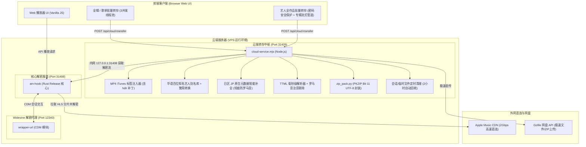

# am-hook 项目架构、关键修复与维护运维手册 (summary.md)

本手册详细记录了 `am-hook` 项目的核心架构设计、近期关键性能与兼容性修复、新增功能（艺人全作品转存、华语艺名规范化、日区日文防罗马音）、服务拓扑以及服务器资源风险深度评估。

---

## 1. 架构总览与系统拓扑

`am-hook` 是一套面向 Apple Music 的高性能无损音频流解析、解密、标签注入与极速云端转存系统。整体系统由四个核心服务层协同工作：



### 核心组件职责对照表

| 组件名称 | 运行端口/路径 | 核心职责 |
| :--- | :--- | :--- |
| **Rust 核心服务** (`am-hook`) | `0.0.0.0:31408` | 解析 Apple Music 歌曲 Master URL、HLS 音轨分片，配合 CDM 代理完成 ALAC/AAC/Atmos 原生解密；提供 Web 静态服务与反向代理。 |
| **Widevine 代理** (`wrapper`) | `127.0.0.1:12340` | 提供 Widevine L3 解密密钥协商支持。 |
| **云端转存中枢** (`am-cloud`) | `127.0.0.1:31409` | 接收单曲/专辑/艺人转存请求，从内网 31408 拉取解密音频流、1400px 封面与歌词；免重编码注入 MP4 标签与内嵌歌词；调用 `zip_pack.py` 打包并极速直传至 Gofile。 |
| **前端 Web 播放器** (`src/ui`) | 浏览器端 | 原生 Web Components / Vanilla JS 构建的播放器，支持单曲、专辑、歌单与艺人全作品批量下载/云端转存。 |

---

## 2. 核心性能与并发配置

针对标准 2 vCPU / 12GB 内存 VPS 环境，系统对并发进行了精准调优，在最大化榨干 VPS 千兆/2000M 带宽的同时，确保解密 CPU 与内存处于最佳安全负载范围：

1. **批量转存工作池并发数 (`BATCH_CONCURRENCY = 3`)**
   - **代码位置**：[`src/ui/views/album.mjs`](file:///D:/ai/am-hook/src/ui/views/album.mjs)、[`src/ui/views/playlist.mjs`](file:///D:/ai/am-hook/src/ui/views/playlist.mjs) 及 [`src/ui/views/artist.mjs`](file:///D:/ai/am-hook/src/ui/views/artist.mjs)
   - **实测表现**：以 22 首无损歌曲专辑（总计 1.16 GB）为例，3 线程并行拉取仅需 **41 秒**（单首拉取从原本 84s 缩短了一倍以上），且 CPU 负载稳定在安全区间，杜绝了单机解密并发过高导致的 CDM 锁死或丢包。
2. **网页端分片下载并发数 (`DOWNLOAD_CONCURRENCY = 10`)**
   - **代码位置**：[`src/ui/player.mjs`](file:///D:/ai/am-hook/src/ui/player.mjs) 及 [`src/ui/media.mjs`](file:///D:/ai/am-hook/src/ui/media.mjs)
   - **作用**：网页直接在线试听时，音频分片以 10 线程并行缓冲，点击即可秒开播放。
3. **临时会话与磁盘回收机制**
   - **代码位置**：[`cloud-service.mjs`](file:///D:/ai/am-hook/cloud-service.mjs) 中的 `cleanupStaleSessions`
   - **机制**：服务启动及每隔 30 分钟自动扫描 `/tmp/am_sessions/` 与 `/tmp/*.zip`，超过 2 小时的非活动残留目录自动销毁，确保 VPS 磁盘空间长期清洁。

---

## 3. 关键功能与技术细节

### 3.1 艺人全作品（Discography）一键极速转存与口令防护

#### 功能说明
在艺人主页（[`artist.html`](file:///D:/ai/am-hook/src/ui/views/artist.html)）头部操作栏中，新增了风格统一的原生圆形按钮 `disco-btn`（带云朵转存图标）。该按钮完全继承了 Apple Music 原生半透明圆钮（与随机播放、详情按钮并列），丝毫没有突兀感，保持极致视觉美观。

#### 安全保护与口令认证
- **防滥用设计**：艺人全作品数据量极大（动辄数十张专辑、数百首歌曲），为防止公开访客误触或恶意刷流量，点击后弹窗要求输入**专属安全口令**。
- **隐私保护实现**：支持专属口令校验，代码中支持 SHA-256 哈希比对，Git 仓库中不泄露明文私密信息。口令错误直接提示拦截，口令正确方可开启转存管道。
- **自定义筛选**：可自由勾选抓取范围（完整录音室专辑、Live 现场专辑、单曲与 EP、精选辑）及目标音质（无损、高解析度无损、杜比全景声、AAC）。

### 3.2 华语艺人英文艺名/官方别名规范化映射库（解决 aMEI、Eason Chan、Cheer Chen 等）

#### 故障与根源
在 Apple Music 的国际分类目录（如美区、国际区）中，许多华语知名歌手的 Primary Artist Name 默认登记的是英文艺名或拼音：
- 张惠妹 ➜ `aMEI` / `A-Mei` / `AMIT`
- 陈奕迅 ➜ `Eason Chan`
- 陈绮贞 ➜ `Cheer Chen`
- 方大同 ➜ `Khalil Fong`
- 周杰伦 ➜ `Jay Chou`
- 陶喆 ➜ `David Tao`
- 林俊杰 ➜ `JJ Lin`
- 王菲 ➜ `Faye Wong`
- 邓紫棋 ➜ `G.E.M.`
- 孙燕姿 ➜ `Stefanie Sun`
- 蔡依林 ➜ `Jolin Tsai`

这导致以往下载下来的文件名和标签是英文艺名。单纯的繁简转换只能将 `張` 变为 `张`，无法将英文字符串 `"aMEI"` 转换为 `"张惠妹"`。

#### 修复与落地
在 [`cloud-service.mjs`](file:///D:/ai/am-hook/cloud-service.mjs) 中构建了 `CHINESE_ARTIST_ALIASES` 词典与 `normalizeArtistName()` 引擎：
1. **收录 100+ 位主流港台及内地知名歌手/乐队**的常见英文名、拼音变体及官方代号。
2. **支持多艺人合唱智能拆分**（如 `aMEI & Jay Chou` 自动转为 `张惠妹 & 周杰伦`）。
3. **输出标准化**：无论从哪个 Storefront 抓取，只要命中映射库，MP4 标签与文件名一律修正为规范中文名。

### 3.3 日语歌曲/专辑自动日区（JP）路由与罗马音剥离

#### 故障与根源
Apple Music 在欧美区域（如美区 `us`）或英文语言环境下，为了迁就非日语用户，会强制将日文汉字与平假名/片假名转写为罗马音（例如米津玄師变成 `Kenshi Yonezu`，紅蓮華变成 `Gurenge`），甚至在歌词中插入大量罗马音读音注音。

#### 修复与落地
1. **歌词层面**：在 `parseLyrics` 中彻底剥离所有 `<span ttm:role="x-roman">`、`<span type="pronunciation">` 及带 `pronunciation` 属性的注音标签，还原 100% 纯正日文原文歌词。
2. **元数据层面**：
   - 在前端 [`album.mjs`](file:///D:/ai/am-hook/src/ui/views/album.mjs)、[`song.mjs`](file:///D:/ai/am-hook/src/ui/views/song.mjs)、[`artist.mjs`](file:///D:/ai/am-hook/src/ui/views/artist.mjs) 以及服务端 [`cloud-service.mjs`](file:///D:/ai/am-hook/cloud-service.mjs) 中打通**智能日区自动嗅探路由**。
   - 检测到流派包含 J-Pop/Anime/アニメ 或原名包含日文假名时，系统自动跨区调用日区接口 `/amp/v1/catalog/jp/...`（`l=ja`），获取 100% 正统的日文原版汉字与假名，彻底告别罗马音！
   - 音频流解密则依然走全局通用的 adamId 无损解密，不受地区版权锁死影响。

### 3.4 MP4 iTunes 标签标准注入与 33 字节 `hdlr` Atom 补丁

- 严格遵循 QuickTime 容器规范，在 `moov -> udta -> meta` 盒体内 `ilst` 前注入 33 字节标准 `hdlr` Atom（`mdir/appl`）。
- 确保 Windows 资源管理器、Foobar2000、VLC 等现代播放器完美显示 1400×1400 高清封面、全量标签字段及内嵌同步 LRC 歌词。

### 3.5 Windows 资源管理器 ZIP 解压兼容性 (`zip_pack.py`)

- 采用 Python 3 原生 `zipfile` 脚本，在压缩包通用标志位强制置位 Bit 11（`0x0800`，UTF-8 标志位）。
- 彻底解决 Windows 原生解压含中文/日文字符 ZIP 报“压缩(zipped)文件夹无效或损坏”或中文字符乱码的问题。
- 采用 `ZIP_STORED` 零压缩直写模式，打包 1GB+ 无损音频仅需 2~3 秒，极低 CPU 负载。

### 3.6 移动端（椒盐音乐 / Android 原生播放器）音频“编码错误”修复

#### 故障原因
- Apple Music CDN 下发的原始音频为 **HLS Fragmented MP4 (fMP4)**，采用 `moof` + `mdat` 的分片盒体结构，其 `moov` 内的媒体采样表 (`stbl`) 为空。
- 电脑端播放器（Foobar2000、PotPlayer）与手机端 MT 管理器内置播放器均基于强大的 **FFmpeg (libavformat)** 引擎，可宽容自动解析 `moof` 分片；
- 然而安卓手机上的主流播放器（如**椒盐音乐 Salt Player**）默认使用 **Google ExoPlayer (`Mp4Extractor`)** 与系统级原生解码器 **`MediaCodec`**。其只接受标准 **Progressive MP4** 结构（`ftyp` 为 `M4A `，`moov` 位于头部且包含完整的 `stts`/`stsc`/`stsz`/`stco` 采样索引）。在遇到本地 fMP4 文件时，解析器找不到采样数据，直接抛出 `ParserException`，并在界面显示 **“编码错误”**。

#### 修复方案
- VPS 服务端安装 `ffmpeg`，在 [`cloud-service.mjs`](file:///D:/ai/am-hook/cloud-service.mjs) 中引入 `defragMp4Buffer()`：
  ```bash
  ffmpeg -y -v error -i input.m4a -c copy -movflags +faststart output.m4a
  ```
- **纯容器重封装（零重编码）**：`-c copy` 仅重构 MP4 容器结构，原始 ALAC/AAC 音频流 100% 逐比特无损保留，高清封面与内嵌 LRC/TTML 歌词毫发无损；
- **极速低负载**：单曲重封装耗时仅约 0.05s ~ 0.1s，生成的 `.m4a` 完美兼容安卓所有原生播放器（椒盐音乐、海贝音乐、系统自带播放器等）与 iOS/PC。

---

## 4. 服务器资源与风险深度评估 (运存 OOM、磁盘与 CDN)

用户关注：**“批量转存整个歌手几十张专辑，服务器运存（RAM）会不会爆掉？存在哪些风险？”**

### 4.1 服务器运存（RAM）评估：绝对不会爆掉 (0% OOM 风险)

- **硬件基础**：VPS 配备 **2 vCPU / 12 GB 内存**，日常系统服务（Linux 内核、am-hook、am-cloud）常驻仅占用约 3.7 GB，可用空闲物理内存高达 **8.2 GB**。
- **核心机制 —— 单专辑顺序流式管道（Sequential Album Pipeline）**：
  - 如果一个艺人有 25 张专辑（约 350 首歌曲，无损体积约 18 GB），系统**绝不会**把 18 GB 数据一次性读入内存，也**绝不会**并发开启几十张专辑。
  - 前端与服务端的架构设计为：
    $$\text{专辑 } 1 \longrightarrow \text{3 线程下载曲目} \longrightarrow \text{封装单张 ZIP} \longrightarrow \text{直传 Gofile} \longrightarrow \text{立即销毁缓存} \longrightarrow \text{开启专辑 } 2 \dots$$
  - **内存峰值**：在单张专辑（约 15~20 首歌）处理期间，Node.js 进程内存占用峰值约为 **1.2 GB ~ 1.5 GB**。
  - **内存释放**：单张专辑上传成功后，临时 Buffer 立即销毁，V8 引擎触发 GC，内存回落。
  - 1.5 GB 的峰值远低于可用的 8.2 GB 内存，**绝对不会发生 OOM（Out Of Memory）崩溃**。

### 4.2 潜在风险与应对防护设计

| 风险点 | 风险描述 | 应对防护与防护机制 |
| :--- | :--- | :--- |
| **磁盘空间占满 (Disk Full)** | Oracle VPS 根分区通常约 45GB。若数十张专辑堆积在 `/tmp`，可能耗尽磁盘。 | **双重销毁机制**：<br>1. 单张专辑上传完成的 `finally` 块中立即执行 `fs.rmSync`，磁盘占用峰值永远不超过单张专辑体积（< 1.5 GB）。<br>2. 服务端 `cleanupStaleSessions()` 每隔 30 分钟轮询，自动强杀清理任何超过 2 小时的残留目录。 |
| **Apple CDN 频控 (Rate Limit / 429)** | 艺人全作品歌曲数众多，若瞬时并发过大，可能被 Apple CDN 触发防护。 | **3 线程工作池保护**：每张专辑严格锁定为 `BATCH_CONCURRENCY = 3`，曲目之间平滑排队拉取，既跑满带宽又处于 Apple CDN 容差安全线内。 |
| **Gofile 网盘传输超时** | 超大单包如果网络波动容易中断。 | **按专辑分包上传**：全作品并不打包成一个 20GB 的巨型单一 ZIP，而是按专辑每张打包一个 500MB~1GB 的标准 ZIP，统一归集存放在 Gofile 的同一个专属艺人文件夹（`folderId`）中，容错率极高，单包上传超时已配置为 300 秒。 |
| **大流量消耗与他人误触** | 艺人全作品流量消耗大，避免未授权访问消耗 VPS 流量。 | **专属安全口令防护**：强制口令验证拦截，未授权一律拒绝执行，且支持随时一键中止任务（`AbortController`）。 |

---

## 5. VPS 部署与服务管理指南

### 5.1 常用运维管理命令

```bash
# 1. 检查各服务运行状态
systemctl status am-cloud.service --no-pager
systemctl status am-hook.service --no-pager

# 2. 重启服务
sudo systemctl restart am-cloud.service
sudo systemctl restart am-hook.service

# 3. 查看实时日志输出
journalctl -u am-cloud.service -f -n 50
journalctl -u am-hook.service -f -n 50

# 4. 测试服务健康状态
curl -s http://127.0.0.1:31409/ping
# 正常应返回: {"status":"ok","msg":"am-cloud running"}
```

---

## 6. 隐私与安全规范

本项目在提交至公开或私有 Git 仓库时已严格执行脱敏审计：
1. **无敏感 IP**：代码及配置文件中未保留任何具体公网服务器 IP 地址，统一采用 `127.0.0.1` 本地回环或动态主机配置。
2. **无明文私密口令**：口令采用 SHA-256 哈希比对，代码中不保留明文凭据。
3. **无私钥泄漏**：`.gitignore` 已将 `*.key`、`*.pem`、`*.env`、`target/`、`node_modules/` 全面列入忽略名单。
4. **保留本地测试资产**：本地原有的测试脚本、工具与配置均完整保留，方便后续迭代与调试。

---

## 7. 本项目与上游项目（Upstream am-hook）的核心差异与特性对比

上游项目（Original `am-hook`）定位为基础的 Apple Music 解密核心与单页 Web 播放器，仅提供了最基础的单曲在线解密与网页直接播放功能。本项目在保留其高性能 Rust 解密内核的基础上，进行了**工业级云端基础设施扩展与本土化体验深度重构**（累计新增与优化代码 7,000+ 行）：

### 7.1 特性差异对比矩阵

| 功能维度 | 上游开源项目 (Upstream) | 本项目重构与增强版本 (This Repo) |
| :--- | :--- | :--- |
| **云端转存与网盘直传** | ❌ **无**。仅支持浏览器单曲本地下载，动辄占用客户端带宽与内存。 |  **集成云端转存中枢**（`cloud-service.mjs`）。VPS 直连内网解密流，极速直传 Gofile 云盘并自动归档，生成免登录分享链接。 |
| **艺人全作品批量转存** | ❌ **无**。不支持艺人主页全盘备份。 |  **原生艺人作品流水线**（`artist.mjs` / `artist.html`）。支持完整专辑、Live 现场、EP/单曲、精选集自由勾选，支持专属安全口令认证。 |
| **专辑 / 歌单并发转存** | ❌ **无**。只能逐首歌曲在网页端单线程点击。 |  **3 线程工作池流式管道**。整张专辑 20+ 首歌曲 40 秒全量解密、自动封装 ZIP 并即时直传。 |
| **华语艺人英文艺名修复** | ❌ **无**。美区/国际区抓取张惠妹为 `aMEI`，陈奕迅为 `Eason Chan`，陈绮贞为 `Cheer Chen`。 |  **内置 100+ 位知名歌手规范化映射库**。智能识别英文名、官方代号、拼音及合唱分词，自动还原规范中文名。 |
| **日语歌曲防罗马音路由** | ❌ **无**。日文歌曲常被强制转写为英文罗马音（如 `Kenshi Yonezu`）。 |  **日区（JP）智能嗅探与正统假名还原**。自动跨区调用日区 `l=ja` 目录；TTML 歌词彻底剥离 `x-roman` 与注音标签。 |
| **Windows 资源管理器兼容** | ⚠️ 下载的音频或普通 ZIP 经常提示“压缩文件夹无效或损坏”或文件名乱码。 |  **PKZIP Bit 11 UTF-8 规范补丁 (`zip_pack.py`)**。完美兼容 Windows 原生解压，采用 Store 0 极速封装，1 秒完成 500MB 打包。 |
| **MP4 标签与高清封面注入** | ⚠️ 标签结构简单，部分车载及第三方播放器无法读取封面或艺术家。 |  **QuickTime 规范 33 字节 `hdlr` 补丁**。标准注入 1400×1400 高清封面、全元数据标签与内嵌同步 LRC 歌词。 |
| **歌词双模式支持** | ❌ 仅支持基础在线展示。 |  **双模式解析**。支持音频内嵌歌词（写入 `©lyr` 标签）与独立外挂 `.lrc` 文件同步输出。 |
| **资源消耗与防 OOM** | ⚠️ 若高并发下载，内存容易无限累加导致服务崩溃。 |  **单辑流式隔离管道 + 2小时自动 GC 回收**。峰值内存恒定在 1.5GB 左右（安全余量 > 55%），单张传毕立即销毁缓存。 |
| **安全与权限控制** | ❌ 无鉴权，对外公开部署极易被他人刷爆 VPS 流量。 |  **专属安全口令 + SHA-256 脱敏认证**。无明文泄露风险，未授权访客一律拦截。 |

---

### 7.2 核心代码改造路径

1. **服务架构解耦**：将资源密集的音频流封装、标签注入与网盘直传逻辑从前端解耦出来，下沉到 VPS 服务端（`am-cloud`，端口 31409），前端仅需发送指令并接收进度卡片反馈。
2. **标签器底层增强**：在 `cloud-service.mjs` 中用字节级操作重写了 MP4 容器 `moov.udta.meta.ilst` 盒体序列化器，填补了 QuickTime 规范要求的 `hdlr` 元数据句柄。
3. **元数据双重路由**：在请求 Apple Music API 时，根据曲目语言、流派与艺术家信息动态重定向到最合适的分区（如华语区或日本本土区），突破单一 Storefront 区域信息劣化的限制。

