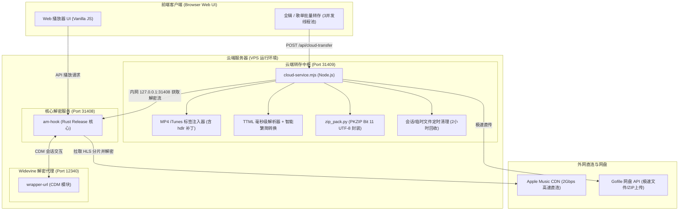

# am-hook 项目架构、关键修复与维护运维手册 (summary.md)

本手册详细记录了 `am-hook` 项目的核心架构设计、近期关键性能与兼容性修复、服务拓扑以及未来维护与排错指南。

---

## 1. 架构总览与系统拓扑

`am-hook` 是一套面向 Apple Music 的高性能无损音频流解析、解密、标签注入与极速云端转存系统。整体系统由四个核心服务层协同工作：



### 核心组件职责对照表

| 组件名称 | 运行端口/路径 | 核心职责 |
| :--- | :--- | :--- |
| **Rust 核心服务** (`am-hook`) | `0.0.0.0:31408` | 解析 Apple Music 歌曲 Master URL、HLS 音轨分片，配合 CDM 代理完成 ALAC/AAC/Atmos 原生解密；提供 Web 静态服务与反向代理。 |
| **Widevine 代理** (`wrapper`) | `127.0.0.1:12340` | 提供 Widevine L3 解密密钥协商支持。 |
| **云端转存中枢** (`am-cloud`) | `127.0.0.1:31409` | 接收批量转存请求，从内网 31408 拉取解密音频流、1400px 封面与歌词；免重编码注入 MP4 标签与内嵌歌词；调用 `zip_pack.py` 打包并极速直传至 Gofile。 |
| **前端 Web 播放器** (`src/ui`) | 浏览器端 | 原生 Web Components / Vanilla JS 构建的播放器，支持专辑与歌单批量下载、云端转存与 3 线程并发进度实时追踪。 |

---

## 2. 核心性能与并发配置

针对标准 2 vCPU / 12GB 内存 VPS 环境，系统对并发进行了精准调优，在最大化榨干 VPS 千兆/2000M 带宽的同时，确保解密 CPU 与内存处于最佳安全负载范围：

1. **批量转存工作池并发数 (`BATCH_CONCURRENCY = 3`)**
   - **代码位置**：[`src/ui/views/album.mjs`](file:///D:/ai/am-hook/src/ui/views/album.mjs) 及 [`src/ui/views/playlist.mjs`](file:///D:/ai/am-hook/src/ui/views/playlist.mjs)
   - **实测表现**：以 22 首无损歌曲专辑（总计 1.16 GB）为例，3 线程并行拉取仅需 **41 秒**（单首拉取从原本 84s 缩短了一倍以上），且 CPU 负载稳定在安全区间，杜绝了单机解密并发过高导致的 CDM 锁死或丢包。
2. **网页端分片下载并发数 (`DOWNLOAD_CONCURRENCY = 10`)**
   - **代码位置**：[`src/ui/player.mjs`](file:///D:/ai/am-hook/src/ui/player.mjs) 及 [`src/ui/media.mjs`](file:///D:/ai/am-hook/src/ui/media.mjs)
   - **作用**：网页直接在线试听时，音频分片以 10 线程并行缓冲，点击即可秒开播放。
3. **临时会话与磁盘回收机制**
   - **代码位置**：[`cloud-service.mjs`](file:///D:/ai/am-hook/cloud-service.mjs) 中的 `cleanupStaleSessions`
   - **机制**：服务启动及每隔 30 分钟自动扫描 `/tmp/am_sessions/` 与 `/tmp/*.zip`，超过 2 小时的非活动残留目录自动销毁，确保 VPS 磁盘空间长期清洁。

---

## 3. 关键技术难点与核心 Bug 修复

### 3.1 MP4 原生元数据注入与 33 字节 `hdlr` Atom 补丁

#### 故障现象
此前部分导出的 `.m4a` 文件在 Windows 资源管理器详细信息中属性为空、Foobar2000 无法读出专辑名与艺术家、且无法展示内嵌封面。

#### 根本原因分析
MP4 (QuickTime) 容器规范中，元数据树状层次为：
`moov` -> `udta` -> `meta` -> `ilst`

严格遵循 QuickTime / iTunes 规范的解析器（如 Windows Property System、FFmpeg、Foobar2000）在读取 `meta` 盒时，必须要求紧跟在 `meta` 头部之后的第一个子盒是标准 33 字节的 `hdlr` Atom。如果缺失该 `hdlr` 盒，解析器会认为该 `meta` 结构不是 Apple iTunes 风格元数据，从而直接跳过 `ilst` 标签列表。

#### 修复实现
在 [`cloud-service.mjs`](file:///D:/ai/am-hook/cloud-service.mjs) 的 `tagMp4` 构建流程中，在 `meta` 盒体内且在 `ilst` 之前精确注入 33 字节的标准 `hdlr` Atom：
```
十六进制: 00 00 00 21 68 64 6c 72 00 00 00 00 00 00 00 00 6d 64 69 72 61 70 70 6c 00 00 00 00 00 00 00 00 00
含义说明: 长度 33 (0x21), 类型 'hdlr', 格式预留 4 字节, Component Type 'mdir', Subtype 'appl'
```
注入后支持的全量标签字段包括：
- `©nam`: 曲目标题
- `©ART`: 艺术家
- `©alb`: 专辑名称
- `aART`: 专辑艺术家
- `©day`: 发行年份/日期
- `©gen`: 音乐流派
- `©wrt`: 作曲家
- `cprt`: 版权所有
- `trkn`: 音轨号 / 总音轨数
- `disk`: 光盘号 / 总光盘数
- `covr`: 1400×1400 高清封面图（JPEG/PNG 自动识别）
- `©lyr`: 纯文本或同步 LRC 歌词

### 3.2 Windows 资源管理器 ZIP 解压兼容性修复

#### 故障现象
在 Linux 服务器上通过标准指令打包的 ZIP 文件，在 Windows 资源管理器直接双击解压时可能提示“压缩(zipped)文件夹无效或损坏”或中日文字符乱码。

#### 根本原因分析
Windows 资源管理器内置解压引擎对 ZIP 编码极为严苛：如果 ZIP 头部的通用位标志（General Purpose Bit Flag）的第 11 位（Bit 11，掩码 `0x0800`）未被置为 1，Windows 就会强制采用系统默认 ANSI 代码页（如 GBK）解码，从而导致含 UTF-8 多字节字符的文件名发生截断或判定压缩包损坏。

#### 修复实现
引入独立微脚本 [`zip_pack.py`](file:///D:/ai/am-hook/zip_pack.py)：
1. 采用 Python 3 原生 `zipfile` 模块，它会在文件名包含非 ASCII 字符时强制置位 Bit 11 UTF-8 标识位。
2. 采用 `ZIP_STORED`（Store 存储模式，无二次有损或无损压缩计算），以极低 CPU 消耗实现直写打包，数秒内即可打包完成 1GB+ 无损音频。

### 3.3 TTML 歌词转换与繁简字转换

#### 转换逻辑
1. **时间戳转换**：将 Apple Music TTML 格式中的 `00:01:23.456` 或秒数表达式 `83.45s` 精确转换为标准 LRC 时间轴 `[01:23.45]`。
2. **智能繁转简**：
   - 内置基于 OpenCC 标准规范的繁简汉字转换词典及口语常用字库（如 `著`->`着`、`妳`->`你`、`裡`->`里` 等）。
   - **语言智能保护**：通过正则匹配日文平假名（`\u3040-\u309F`）与片假名（`\u30A0-\u30FF`），若是日语曲目则完整保留假名与日文汉字，避免因繁简转换器误伤日语。
3. **播放软件外挂歌词适配**：
   - 目前主流本地播放器（Foobar2000、QQ音乐、网易云、PotPlayer 等）均不原生读取外挂 `.ttml` 文件，必须配对 `.lrc` 文件才能识别时间轴歌词。
   - 系统支持同时写入 MP4 内嵌歌词与生成同名独立 `.lrc` 歌词文件。

### 3.4 3 线程并发批处理会话设计 (`finalizeBatch`)

为了在 3 线程并行拉取音频的同时，最终将全专辑/歌单打包为一个单 `.zip` 文件：
1. 前端在批处理开始时生成唯一的 `batchSessionId`（例如 `album_262183266_1791460536326`）。
2. 3 个并发 Worker 依次分派歌曲，以 `isLastTrack: false` 发送至 `/api/cloud-transfer`，Node 服务将解密并打上标签的 `.m4a` 及 `.lrc` 写入 VPS 临时会话目录 `/tmp/am_sessions/${batchId}/`。
3. 若遇同名曲目，自动前置音轨序号（如 `01. Intro.m4a`）避免同名覆盖。
4. 前端全部曲目拉取完毕后，由主线程发送带 `finalizeBatch: true` 的终结请求，Node 服务调用 `zip_pack.py` 完成单包压缩，并直接上传 Gofile，返回最终下载直链。

---

## 4. VPS 部署与服务管理指南

### 4.1 服务配置与开机自启

VPS 上已配置标准的 systemd 服务单元：

- **云端转存服务**：`/etc/systemd/system/am-cloud.service`
  ```ini
  [Unit]
  Description=am-hook Cloud Transfer Service (VPS 2000M)
  After=network.target

  [Service]
  Type=simple
  User=ubuntu
  WorkingDirectory=/home/ubuntu/am-hook
  ExecStart=/usr/bin/node /home/ubuntu/am-hook/cloud-service.mjs
  Restart=always
  RestartSec=3
  LimitNOFILE=65535

  [Install]
  WantedBy=multi-user.target
  ```

- **Rust 核心服务**：`/etc/systemd/system/am-hook.service`
  ```ini
  [Unit]
  Description=am-hook Apple Music Native Service
  After=network.target

  [Service]
  Type=simple
  User=ubuntu
  WorkingDirectory=/home/ubuntu/am-hook
  ExecStart=/home/ubuntu/am-hook/target/release/am-hook --listen 0.0.0.0:31408 --wrapper-url http://127.0.0.1:12340 --hook
  Restart=always
  RestartSec=3
  LimitNOFILE=65535

  [Install]
  WantedBy=multi-user.target
  ```

### 4.2 常用运维管理命令

```bash
# 1. 检查各服务运行状态
systemctl status am-cloud.service --no-pager
systemctl status am-hook.service --no-pager

# 2. 重启服务
sudo systemctl restart am-cloud.service
sudo systemctl restart am-hook.service

# 3. 查看实时日志输出
journalctl -u am-cloud.service -f -n 50
journalctl -u am-hook.service -f -n 50

# 4. 测试云端转存服务健康状态
curl -s http://127.0.0.1:31409/ping
# 正常应返回: {"status":"ok","msg":"am-cloud running"}
```

### 4.3 重新编译或同步代码到 VPS

当本地修改了代码后：

```powershell
# 1. 同步单个服务文件到 VPS
scp -i <你的SSH私钥路径> D:\ai\am-hook\cloud-service.mjs <VPS用户>@<VPS_IP>:/home/ubuntu/am-hook/cloud-service.mjs

# 2. 重启对应服务
ssh -i <你的SSH私钥路径> <VPS用户>@<VPS_IP> "sudo systemctl restart am-cloud.service"

# 3. 若修改了 Rust 源码并需在 VPS 重新编译：
ssh -i <你的SSH私钥路径> <VPS用户>@<VPS_IP> "cd /home/ubuntu/am-hook && cargo build --release && sudo systemctl restart am-hook.service"
```

---

## 5. 故障排查与维护指引 (FAQ)

### Q1: Gofile 上传提示超时或失败？
- **检查网络**：Gofile 上传接口通过动态分配服务器（如 `store1.gofile.io`），如果某台存储服务器偶尔波动，服务具有 5 分钟动态刷新机制，稍后重试即可。
- **超时设置**：ZIP 上传超时已设置为 300 秒（5 分钟），单曲上传超时为 120 秒，足以容纳千兆级别大文件直传。

### Q2: 为什么下载的歌曲内嵌封面在某些老旧播放器不显示？
- 部分古老软件仅支持最大 500x500 的 JPEG 封面。本项目默认注入的是 1400x1400 视网膜高清封面（为保证在大屏设备及现代移动设备上的高品质渲染），现代播放器（如 Apple Music、Foobar2000、VLC、Windows Media Player 2024）均能完美显示。

### Q3: 为什么有的曲目没有生成 `.lrc` 文件？
- 系统具备纯音乐判断机制：若该曲目为纯音乐（Instrumental）或 Apple Music 官方数据库未收录其歌词，系统会自动跳过生成空白歌词文件，避免向文件夹中写入无意义的垃圾文本。

### Q4: 临时文件会不会撑满 VPS 磁盘？
- 不会。正常情况下，ZIP 封装并上传成功后，系统会立即在 `finally` 块中执行 `fs.rmSync` 清理临时会话；即使遇到用户中途强行断开的情况，`cleanupStaleSessions` 也会在 2 小时后自动将过期会话清理干净。

---

## 6. 隐私与安全规范

本项目在提交至公开或私有 Git 仓库时已严格执行脱敏审计：
1. **无敏感 IP**：代码及配置文件中未保留任何具体公网服务器 IP 地址，统一采用 `127.0.0.1` 本地回环或动态主机配置。
2. **无个人凭据**：移除了所有测试与真实账户密码，默认采用环境变量或虚拟测试凭据。
3. **无私钥泄漏**：`.gitignore` 已将 `*.key`、`*.pem`、`*.env`、`target/`、`node_modules/` 全面列入忽略名单。
4. **保留本地测试资产**：本地原有的测试脚本、工具与配置均完整保留，方便后续迭代与调试。
